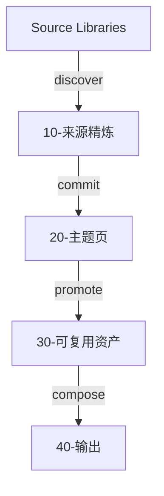
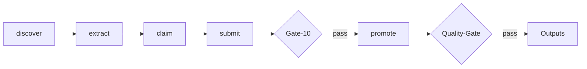
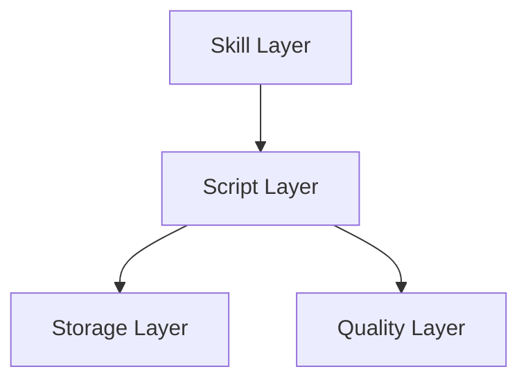

# Architecture
> 面向产出的研究型知识管理系统 — 业务架构与系统架构

## Business Architecture（业务架构）
### Core Model: Five-Layer Knowledge Pipeline

Source Libraries（原文库: ebooks, public accounts, articles） → 10-来源精炼（逐篇精炼笔记, Gate-10 quality gate） → 20-主题页（语义聚类, 推广评分） → 30-可复用资产（Methods, Cases, Expressions, Frameworks） → 40-输出（Feynman explanations, article drafts, solution materials, decision memos）

Value chain: raw materials → structured understanding → synthesized judgment → reusable building blocks → reader-facing products.

### User Workflow
1. Add sources to source libraries (ebooks, public accounts, articles)
2. Run pipeline: discover → extract → claim → submit → commit
3. Gate-10 checks refinement quality (structure, content integrity, batch repetition)
4. Promote clusters: score each cluster on 5 dimensions
5. Create topic pages for clusters scoring 3+
6. Extract reusable assets (methods, cases, expressions, frameworks)
7. Compose outputs (Feynman, drafts, solution materials)
8. Quality-gate verifies relations, portability, topic pages, outputs, verification

### Roles
| Role | Responsibility | Tools |
| Human | Collect sources, review promotions, verify facts, approve outputs | File system, verification commands |
| Codex (AI) | Read & refine, synthesize topics, extract assets, draft outputs | SKILL.md + references |
| Deterministic scripts | Init, index, cluster, gate, lint | kb_manager.py, kb_pipeline.py, obsidian_linker.py |

## System Architecture（系统架构）
### Component Stack

Skill Layer（可读指令）: SKILL.md, references/  →  guides → Script Layer（确定性操作）: kb_manager.py, kb_pipeline.py, obsidian_linker.py  →  reads/writes → Storage Layer（文件系统）: 00-system/, 10-/, 20-/, 30-/, 40-/  ←→  Quality Layer（质量门禁）: Gate-10, Quality-Gate, Verification-Queue, Output-Review, Package-Lint

### 00-system/ Directory Structure

active/  （current working state, not regenerable）:
 processed-index.jsonl, run-log.jsonl, active-run-state.json, promotion-decision.jsonl, verification-queue.jsonl, verification-results.jsonl, output-review-results.jsonl, rules.md, topics.md

reports/  （regenerable snapshots）:
 topic-clusters.md, promotion-review.md, asset-output-candidates.md, quality-gate.md, gate-10.md, verification-status.md, output-quality-review.md, output-review-status.md, portability-audit.md, topic-page-audit.md, relation-audit.md, asset-relation-audit.md, inbox-review.md

backups/ （auto-rotating, max 5 per file）:
 processed-index.jsonl.*, quality-gate.md.*, etc.

### Scoring Model
5 independent dimensions, 1 point each:

| Dimension | Manual cluster | Auto-discovered (before v0.1.1) | Auto-discovered (v0.1.1) |
| Source count >= threshold | Yes | Yes | Yes |
| Clear question | Yes (pre-configured) | No (blocked by auto_discovered flag) | Yes (inferred when >= threshold) |
| Reusability | Yes (pre-configured asset_type) | No (defaults to unclassified) | Yes (keyword match or 2x threshold sources) |
| Output intent | Yes (pre-configured output_type) | No (no output_type) | Yes (keyword match or 2x threshold sources) |
| Risk controlled | Yes (had bug, always 1) | Yes (same bug) | Yes (fixed: high risk needs explicit verification) |

## Key Design Decisions

### Why 5 layers instead of flat tags?
Ensures each layer answers a specific question: What does this source say? (refinement), What is our judgment on X? (topic page), What can we reuse? (assets), Who can use this and how? (outputs).

### Why script-first instead of pure Codex skill?
Deterministic scripts work on any AI platform or plain terminal. SKILL.md is the Codex entrypoint but not the only way to operate the system.

### Why portable methodology ≠ user's folder names?
A methodology doc full of /Users/xxx/ path references is useless to the next user. The skill strictly separates universal method from implementation mapping. Personal paths only appear in explicit example blocks or 00-system/ config.

### Why quality gates before output?
AI-generated refinements have three failure modes: template-filling, fabricating claims, and batch-level repetition. Gate-10's three checks target these directly.

## Architecture Diagrams

### Five-Layer Pipeline

### Quality Gate Flow

### Component Architecture

## Related Documents
- SKILL.md: Codex entrypoint, commands, quality controls
- README.md: Chinese user guide, installation, usage
- references/pipeline.md: Pipeline state model, batch protocol, leases
- references/reading-and-refinement.md: Reading protocol, Gate-10 depth requirements
- references/setup-and-config.md: Configuration schema, directory mapping
- references/promotion-control-and-resume.md: Cost tiers, approval gates, checkpoint recovery
- references/asset-output-matrix.md: Asset and output trigger matrix
- CHANGELOG.md: Version history
